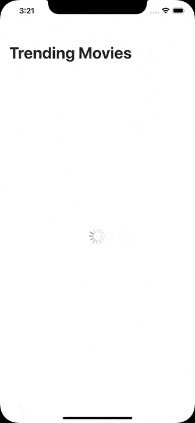

# ModernMVVM

A sample project demonstrating a modern iOS app with the MVVM architecture pattern, Combine and SwiftUI frameworks. The app follows unidirectional data flow and shows how to represent the UI as a reactive finite-state machine using [CombineFeedback](https://github.com/sergdort/CombineFeedback).

---

## Article related to this project

- [Modern MVVM iOS App Architecture with Combine and SwiftUI](https://www.vadimbulavin.com/modern-mvvm-ios-app-architecture-with-combine-and-swiftui/).
